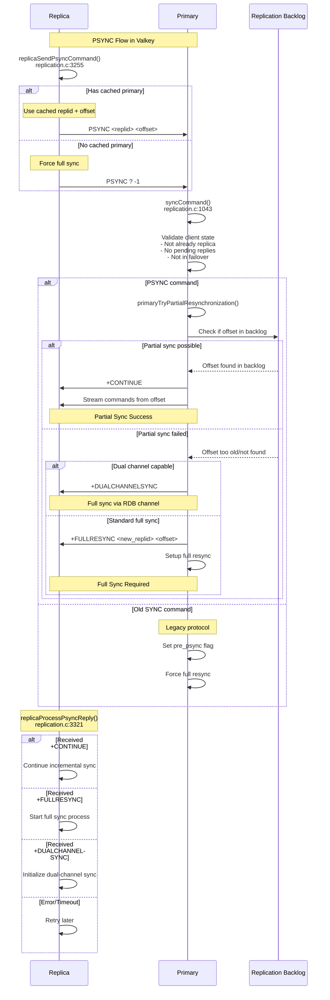

# PSYNC

Here’s a concise walkthrough of how `syncCommand` handles a replica’s SYNC/PSYNC request, 
the decision flow, and what the replica is expected to receive.

## High-level purpose
- Accept an incoming replica connection and decide whether to:
    - Perform a partial resynchronization (PSYNC).
    - Fall back to a full resynchronization (RDB + live stream).
- Set the replica’s state and trigger or attach to a background save (BGSAVE) accordingly.
- Enforce safety and protocol requirements (failover state, capabilities, pending output, etc.).

## Step-by-step flow
1) Early exits and setup
- If the client is already a replica, return early.
- Initialize replication-related fields on the client.
- Wait for any pending IO for this client to finish before changing its state to a replica.

2) Optional failover request via PSYNC
- If the command is PSYNC with a trailing argument “failover”:
    - Validate that the server is currently a replica (has a primary).
    - Validate that the provided replid matches this server’s replid.
    - If valid, promote this server to primary (cluster or standalone path) and log it.
    - If invalid, return an error.

3) Refuse during failover or if upstream is down
- If the server itself is in an internal failover procedure, reject with an error.
- If this server is a replica and currently not connected to its own primary, reject with an error.

4) No pending output allowed
- If the client has pending replies, reject SYNC/PSYNC because we need a “clean” output buffer for RDB + subsequent streaming.

5) Capability checks for filtered RDB
- If the replica requested a filtered RDB but doesn’t support EOF, reject (filtered RDBs are sent over a socket and require EOF capability).

6) Partial resync attempt (PSYNC path)
- If the command is PSYNC:
    - Parse the requested offset.
    - Try partial resynchronization:
        - On success:
            - Stats are updated and the function returns. The partial resync handshake (including the positive reply) is handled elsewhere.
        - On failure:
            - If the replica indicated capability for dual-channel sync, send:
                - +DUALCHANNELSYNC
                - Then return; the dedicated RDB channel flow will proceed elsewhere.
            - Otherwise, proceed to full resync.
- If the command is SYNC (legacy):
    - Mark the client as pre-PSYNC (older protocol; don’t expect REPLCONF ACKs).
    - Proceed to full resync.

7) Switch to full resynchronization path
- Increment full-sync stats.
- Mark the client as a replica and set its replication state to “waiting for BGSAVE start”.
- Optionally disable TCP_NODELAY on the replica socket to reduce small-packet overhead during initial sync.
- Link the client into the server’s replica list and initialize its RDB-related file descriptor.

8) Ensure the replication backlog exists
- If this is the first connected replica and no backlog exists:
    - Rotate to a new replication ID (and clear the secondary ID).
    - Create the replication backlog buffer.
    - Log the new replid values.
    - This ensures future PSYNCs can succeed.

9) Decide how to provide the RDB
- Case 1: A disk-based BGSAVE is in progress
    - Try to attach this replica to the ongoing BGSAVE if:
        - There is another replica already in “WAIT_BGSAVE_END”, and
        - This client’s capabilities are a superset of that replica’s capabilities, and
        - Replica requirements match exactly.
    - If attachable:
        - Optionally copy the other replica’s output buffer to this client (unless this client requested RDB-only).
        - Prepare this client for full resync (this path is where the replica receives +FULLRESYNC <replid> <offset>).
        - Log that we’re waiting for the end of the current BGSAVE.
    - Otherwise:
        - Log that we’ll wait for the next BGSAVE.

- Case 2: A socket-based (diskless) BGSAVE is in progress
    - Can’t attach mid-run; log that we’ll wait for the next BGSAVE.

- Case 3: No BGSAVE is running
    - If diskless sync is enabled, the replica supports EOF, and a diskless delay is configured:
        - Defer starting the child; a timer allows more replicas to arrive before forking (handled in the cron).
        - Log that we’re delaying the BGSAVE.
    - Else:
        - If no other background child is active, start a BGSAVE suited to the replica’s capabilities and requirements.
        - If some other background job is active (e.g., AOF rewrite), log that BGSAVE for replication is delayed.

## What the replica receives
- Errors
    - -NOMASTERLINK Can't SYNC while failing over
    - -NOMASTERLINK Can't SYNC while not connected with my master
    - SYNC and PSYNC are invalid with pending output
    - Filtered replica requires EOF capability
    - PSYNC FAILOVER can't be sent to a master.
    - PSYNC FAILOVER replid must match my replid.

- Partial resync accepted (PSYNC)
    - The positive reply for partial resync (and state updates) is handled in the partial-resync helper; on success, syncCommand returns early.

- Dual channel negotiation
    - +DUALCHANNELSYNC if partial sync is not possible and the replica supports dual-channel synchronization.
    - After that, the dedicated RDB channel is handled by the dual-channel flow.

- Full resynchronization
    - replicationSetupReplicaForFullResync sends:
        - +FULLRESYNC <replid> <offset>
    - Then the server transfers the RDB (via disk or socket) followed by the live command stream.

## Compressed pseudocode of the flow

```c
void syncCommand(client *c) {
    if (c->flag.replica) return;
    initClientReplicationData(c);
    waitForClientIO(c);

    if (is_psync_failover_request(c)) {
        if (!is_replica_server()) return error("...to a master");
        if (!replid_matches()) return error("...replid must match");
        promote_to_primary(); // or unset primary in non-cluster
    }

    if (server_in_failover()) return error("-NOMASTERLINK ...failing over");
    if (is_replica_server() && !connected_to_primary()) return error("-NOMASTERLINK ...not connected");

    if (clientHasPendingReplies(c)) return error("SYNC and PSYNC are invalid with pending output");
    if (wants_filtered_rdb_but_no_eof(c)) return error("Filtered replica requires EOF capability");

    if (is_psync(c)) {
        long long offset = parse_psync_offset_or_error();
        if (try_partial_resync(c, offset) == OK) return;
        if (replica_supports_dual_channel(c)) {
            send_to_client("+DUALCHANNELSYNC");
            return;
        }
    } else {
        c->flag.pre_psync = 1; // legacy SYNC
    }

    // Full resync path
    mark_client_as_replica_waiting_for_bgsave(c);
    ensure_replication_backlog_exists_if_first_replica();

    if (disk_bgsave_in_progress()) {
        if (can_attach_to_ongoing_bgsave(c, some_replica)) {
            maybe_copy_output_buffer(c, some_replica);
            replicationSetupReplicaForFullResync(c, some_replica->psync_initial_offset); // sends +FULLRESYNC
        } else {
            // wait for next BGSAVE
        }
    } else if (socket_bgsave_in_progress()) {
        // wait for next BGSAVE
    } else {
        if (should_delay_diskless_sync(c)) {
            // delay; cron will start it
        } else if (!hasActiveChildProcess()) {
            startBgsaveForReplication(c->capa, c->req);
        } else {
            // another BG op is active; delay
        }
    }
}
```

## Key state and flag effects
- c->flag.replica = 1: marks this client as a replica.
- c->flag.pre_psync = 1 for legacy SYNC clients: do not expect REPLCONF ACKs.
- c->repl_data->repl_state transitions through “WAIT_BGSAVE_START”, then “WAIT_BGSAVE_END”, then streaming.
- Replication backlog is created/rotated when the first replica connects and none exists, ensuring future PSYNC viability.

## Summary
- syncCommand enforces safe conditions, negotiates PSYNC vs full sync, and orchestrates BGSAVE attachment or initiation. On success, the replica either gets a partial resync acceptance (handled in the PSYNC helper), or a full resync kickoff signaled by +FULLRESYNC <replid> <offset>, possibly preceded by +DUALCHANNELSYNC if using a dedicated RDB channel.

# PSYNC

⏺ PSYNC is Valkey's (formerly Redis) Partial Synchronization protocol used for efficient replication between primary and replica servers.

Key Concepts

PSYNC allows replicas to reconnect to a primary and continue replication from where they left off, rather than requiring a full resynchronization. This dramatically
reduces network bandwidth and improves failover times.

How PSYNC Works

1. Command Format

PSYNC <replication-id> <offset>
- replication-id: Unique identifier of the primary server's dataset
- offset: Last replication offset the replica processed

2. Possible Responses

The primary can respond with:

- +CONTINUE: Partial sync possible - replica can continue from current offset
- +FULLRESYNC <replid> <offset>: Full sync required - new replication ID and starting offset provided
- +DUALCHANNELSYNC: Full sync via dedicated RDB channel (dual-channel replication)
- -NOMASTERLINK: Primary can't sync (not connected to its own primary or during failover)

3. Implementation Details

Primary side (syncCommand in replication.c:1043):
- Validates replica capabilities and connection state
- Attempts partial resynchronization via primaryTryPartialResynchronization()
- Falls back to full sync if partial sync fails

Replica side (replicaSendPsyncCommand in replication.c:3255):
- Sends PSYNC with cached primary's replication ID and offset
- If no cached primary exists, sends PSYNC ? -1 to force full sync

4. Replication Backlog

PSYNC relies on the primary maintaining a replication backlog - a circular buffer that stores recent commands. If the replica's offset is still within this buffer,
partial sync is possible.

5. Special Cases

- First connection: Replica sends PSYNC ? -1
- Failover: Can include FAILOVER parameter for coordinated failover
- Dual-channel: Modern enhancement using separate RDB channel for full syncs

PSYNC significantly improves replication reliability by avoiding expensive full synchronizations when brief disconnections occur.

# PSYNC Code Flow Diagram



## Key Code Paths

### Replica Side Flow
```
replicaSendPsyncCommand() [replication.c:3255]
├── Check if dual-channel state active
├── Use cached primary info OR send PSYNC ? -1
├── Send PSYNC command to primary
└── Return PSYNC_WAIT_REPLY

replicaProcessPsyncReply() [replication.c:3321]
├── Parse primary response
├── Handle +CONTINUE → partial sync
├── Handle +FULLRESYNC → full sync
├── Handle +DUALCHANNELSYNC → dual-channel
└── Handle errors/timeouts
```

### Primary Side Flow
```
syncCommand() [replication.c:1043]
├── Validate replica connection state
├── Check for failover coordination
├── Handle PSYNC vs legacy SYNC
├── Attempt primaryTryPartialResynchronization()
│   ├── Check replication backlog
│   ├── Verify offset is available
│   └── Return success/failure
├── On partial sync success → send +CONTINUE
├── On partial sync failure → setup full resync
│   ├── Check dual-channel capability
│   ├── Send +DUALCHANNELSYNC OR +FULLRESYNC
│   └── Initialize RDB transfer
└── Update replication statistics
```

## Return Codes
- `PSYNC_WAIT_REPLY` (0): Waiting for response
- `PSYNC_WRITE_ERROR` (1): Network write failed
- `PSYNC_CONTINUE` (2): Partial sync continues
- `PSYNC_FULLRESYNC` (3): Full sync required
- `PSYNC_NOT_SUPPORTED` (4): Primary doesn't support PSYNC
- `PSYNC_TRY_LATER` (5): Temporary error, retry
- `PSYNC_FULLRESYNC_DUAL_CHANNEL` (6): Full sync via RDB channel